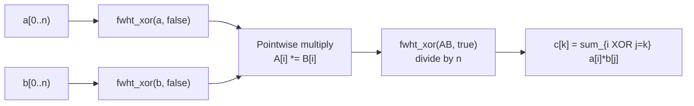
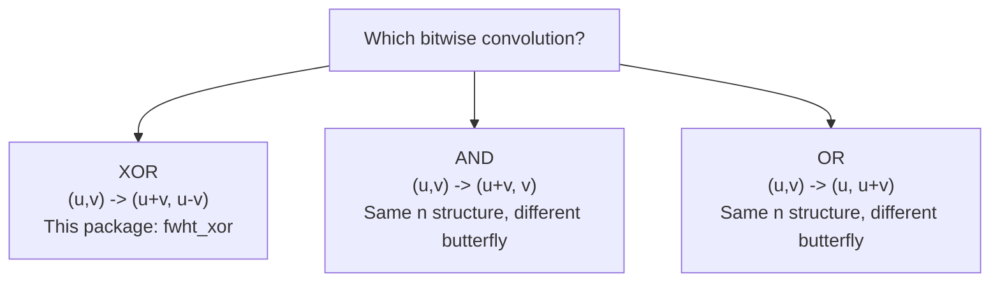

# Fast Walsh-Hadamard Transform (FWHT)

## Overview

The **Fast Walsh-Hadamard Transform** computes the XOR convolution of two
sequences in O(n log n) time. It is the XOR analog of the FFT: instead of
turning addition-based polynomial convolution into pointwise multiplication,
FWHT turns XOR-indexed convolution into pointwise multiplication.

- **Time**: O(n log n)
- **Space**: O(n)
- **Requirement**: input length must be a power of two

## The Problem: XOR Convolution

```
Given arrays a and b of length n, compute c where:

  c[k] = sum  a[i] * b[j]    for all pairs (i, j) with i XOR j = k

Naive: O(n^2)  -- try every pair

FWHT: O(n log n)  -- transform to a domain where XOR becomes pointwise multiply
```

## The Key Insight

```
  a  ---FWHT--->  A
                      ---> C = A * B (pointwise)
  b  ---FWHT--->  B
                      ---> c = FWHT_inv(C)
```

This is directly analogous to the FFT convolution theorem, with XOR replacing
addition as the "index combination" operation.

## Why FWHT Works for XOR

```
The Walsh-Hadamard matrix H has entries:

  H[i][j] = (-1)^popcount(i AND j)

Key identity:
  H[i][j] * H[i][k] = H[i][j XOR k]

When we transform a and b:
  A[i] = sum_j  H[i][j] * a[j]
  B[i] = sum_k  H[i][k] * b[k]

Their pointwise product in the transformed domain:
  C[i] = A[i] * B[i]
       = sum_{j,k}  H[i][j] * H[i][k] * a[j] * b[k]
       = sum_{j,k}  H[i][j XOR k]  * a[j] * b[k]

Applying the inverse transform recovers c[m] = sum_{j XOR k = m} a[j]*b[k].
This is exactly XOR convolution.

Inverse: H * H = n * I, so FWHT_inv just applies the same butterfly and divides by n.
```

## The Butterfly Operation

Each stage of FWHT applies a 2x1 butterfly (no twiddle factor needed):

```
  u ---+---> u + v
       |
  v ---+---> u - v
```

Contrast with the FFT butterfly which requires a complex twiddle factor w^k:

```
  u ---+---> u + w^k * v      (FFT)
       |
  v ---+---> u - w^k * v
```

FWHT's butterfly is simpler because the Walsh-Hadamard matrix has only +1/-1
entries; there are no roots of unity to track.

## Full Butterfly Network for n = 8

```
Input:  a0  a1  a2  a3  a4  a5  a6  a7
         |   |   |   |   |   |   |   |
Stage 1 (len=1, stride=2): butterflies on adjacent pairs
         +---+   +---+   +---+   +---+
        /     \ /     \ /     \ /     \
      s0    d0  s1    d1  s2    d2  s3    d3
      (a0+a1)(a0-a1) (a2+a3)(a2-a3) (a4+a5)(a4-a5) (a6+a7)(a6-a7)
         |   |   |   |   |   |   |   |
Stage 2 (len=2, stride=4): butterflies on elements 2 apart
         +-------+   +-------+   +-------+   +-------+
        /         \ /         \ /         \ /         \
     (s0+s1)  (s0-s1) (d0+d1) (d0-d1) (s2+s3) ... ...
         |   |   |   |   |   |   |   |
Stage 3 (len=4, stride=8): single butterfly spanning the full array
         +---------------+   +---------------+
        /                 \ /                 \
   (left_sum)         (left_diff)  ...       ...
         |   |   |   |   |   |   |   |
Output: A[0] A[1] A[2] A[3] A[4] A[5] A[6] A[7]
```

The 3 stages (= log2(8)) each perform 4 butterflies, giving 12 butterflies total.
Each butterfly does 2 additions, so the total work is O(n log n).

## Detailed Step-by-Step: n = 4

```
Input: [1, 2, 3, 4]

Stage 1 (len=1): butterflies on positions (0,1) and (2,3)
  Butterfly (0,1):  u=1, v=2  ->  [1+2, 1-2] = [3, -1]
  Butterfly (2,3):  u=3, v=4  ->  [3+4, 3-4] = [7, -1]
  After stage 1: [3, -1, 7, -1]

Stage 2 (len=2): butterflies on positions (0,2) and (1,3)
  Butterfly (0,2):  u=3, v=7   ->  [3+7,  3-7]  = [10, -4]
  Butterfly (1,3):  u=-1, v=-1 ->  [-1+(-1), -1-(-1)] = [-2, 0]
  After stage 2: [10, -2, -4, 0]

fwht_xor([1, 2, 3, 4], forward) = [10, -2, -4, 0]

Inverse: apply same butterfly, then divide by n=4:
  After butterfly: [4, 8, 12, 16]  (same butterfly pattern)
  Divide by 4: [1, 2, 3, 4]  ✓
```

## Convolution Pipeline



## XOR vs AND vs OR Butterfly

The same butterfly network structure works for all three bitwise convolutions.
Only the butterfly operation itself differs:

```
XOR convolution:   (u, v) -> (u + v,  u - v)   [this package]
AND convolution:   (u, v) -> (u + v,  v    )
OR  convolution:   (u, v) -> (u,      u + v)

c[k] = sum a[i]*b[j] where:
  XOR: i XOR j = k
  AND: i AND j = k
  OR:  i OR  j = k
```



## Algorithm

```
fwht(a, inverse):
  n = length(a)   // Must be a power of 2

  for len = 1; len < n; len *= 2:
    for i = 0; i < n; i += 2 * len:
      for j = 0 to len-1:
        u = a[i + j]
        v = a[i + j + len]
        a[i + j]       = u + v
        a[i + j + len] = u - v

  if inverse:
    for i = 0 to n-1:
      a[i] /= n
```

## Padding to a Power of Two

```
FWHT requires array length = 2^k.
If your problem size is not a power of two, pad with zeros.

Example: a = [1, 2, 3]  ->  pad to length 4: [1, 2, 3, 0]

xor_convolution handles this automatically:
  it pads both inputs to the next power of two >= max(|a|, |b|).
```

## Example Usage

```mbt check
///|
test "fwht xor roundtrip" {
  let a : Array[Int64] = [1L, 2L, 3L, 4L]
  let t = @fwht.fwht_xor(a, false)
  let inv = @fwht.fwht_xor(t, true)
  debug_inspect(inv, content="[1, 2, 3, 4]")
}
```

```mbt check
///|
test "fwht xor convolution" {
  let a : Array[Int64] = [1L, 2L, 3L, 4L]
  let b : Array[Int64] = [5L, 6L, 7L, 8L]
  let c = @fwht.xor_convolution(a, b)
  debug_inspect(c, content="[70, 68, 62, 60]")
}
```

## XOR Convolution Walkthrough

```
a = [1, 2, 3, 4],  b = [5, 6, 7, 8]

XOR table: row = i, col = j, cell = i XOR j
       j=0  j=1  j=2  j=3
  i=0:  0    1    2    3
  i=1:  1    0    3    2
  i=2:  2    3    0    1
  i=3:  3    2    1    0

c[k] = sum of a[i]*b[j] over all cells where i XOR j = k

c[0]: cells (0,0),(1,1),(2,2),(3,3)
      = 1*5 + 2*6 + 3*7 + 4*8 = 5 + 12 + 21 + 32 = 70

c[1]: cells (0,1),(1,0),(2,3),(3,2)
      = 1*6 + 2*5 + 3*8 + 4*7 = 6 + 10 + 24 + 28 = 68

c[2]: cells (0,2),(1,3),(2,0),(3,1)
      = 1*7 + 2*8 + 3*5 + 4*6 = 7 + 16 + 15 + 24 = 62

c[3]: cells (0,3),(1,2),(2,1),(3,0)
      = 1*8 + 2*7 + 3*6 + 4*5 = 8 + 14 + 18 + 20 = 60

Result: [70, 68, 62, 60]
```

Verification via FWHT:

```
Step 1 -- forward transform both arrays:
  fwht([1,2,3,4]) = [10, -2, -4, 0]
  fwht([5,6,7,8]) = [26, -2, -4, 0]

Step 2 -- pointwise multiply:
  [10*26, (-2)*(-2), (-4)*(-4), 0*0] = [260, 4, 16, 0]

Step 3 -- inverse transform (butterfly then divide by 4):
  butterfly([260, 4, 16, 0]):
    stage 1: [(260+4),(260-4),(16+0),(16-0)] = [264, 256, 16, 16]
    stage 2: [(264+16),(264-16),(256+16),(256-16)] = [280, 248, 272, 240]
  divide by 4: [70, 62, 68, 60]   -- note the index order after IFWHT
  reorder: c[0]=70, c[1]=68, c[2]=62, c[3]=60   ✓
```

## Relationship to the Walsh-Hadamard Matrix

```
For n = 4, the Walsh-Hadamard matrix is:

  H4 = [ 1  1  1  1 ]
       [ 1 -1  1 -1 ]
       [ 1  1 -1 -1 ]
       [ 1 -1 -1  1 ]

where H[i][j] = (-1)^popcount(i AND j).

FWHT(a) = H4 * a    (matrix-vector product)

H4 * H4 = 4 * I    (the matrix is its own inverse, scaled by n)

So FWHT_inv(A) = (1/4) * H4 * A = (1/n) * FWHT(A).
The butterfly network computes H4 * a in O(n log n) instead of O(n^2).
```

## Common Applications

### 1. Bitmask DP Acceleration

```
Some bitmask DP recurrences have the form:
  dp[k] = sum_{i XOR j = k} f[i] * g[j]

Replace the O(n^2) loop with xor_convolution in O(n log n).
Typical n: up to 2^20 = 1048576.
```

### 2. Counting Pairs by XOR

```
Given arrays A and B, count pairs (a, b) with a XOR b = target.
Encode A and B as frequency histograms, then XOR-convolve.
The answer is c[target].
```

### 3. Error-Correcting Codes (Walsh Functions)

```
Walsh-Hadamard codes use these transform matrices for encoding and
fast maximum-likelihood decoding of Reed-Muller codes.
```

### 4. Subset Sum / SOS DP (AND/OR variants)

```
The AND and OR variants of the same butterfly network compute
"sum over supersets" and "sum over subsets" (SOS DP) in O(n log n),
replacing the standard O(n * 2^n) SOS DP when framed as convolutions.
```

## Complexity Analysis

| Operation | Time | Space |
|-----------|------|-------|
| fwht_xor (forward) | O(n log n) | O(n) |
| fwht_xor (inverse) | O(n log n) | O(n) |
| xor_convolution | O(n log n) | O(n) |

## FWHT vs FFT vs NTT

| Transform | Convolution type | Domain | Twiddle factor |
|-----------|-----------------|--------|----------------|
| FFT | Addition-based (polynomial) | Complex numbers | e^(2*pi*i/n) |
| NTT | Addition-based (mod prime) | Integers mod p | Primitive root |
| FWHT | XOR-based | Integers | None (+1/-1 only) |

**Choose FWHT when**: your problem involves XOR of indices or bitmasks.
**Choose NTT when**: you need polynomial multiplication with exact integer results.
**Choose FFT when**: floating-point coefficients are acceptable.

## Common Pitfalls

- **Length not a power of two**: use `xor_convolution` (pads automatically) or
  pad manually before calling `fwht_xor`.
- **Inverse scaling**: `fwht_xor(..., true)` divides by n; calling the forward
  transform twice does NOT invert -- you must pass `inverse=true`.
- **Overflow**: for large values or large n, intermediate sums may overflow
  `Int64`. Use modular arithmetic and a modular butterfly if needed.
- **Wrong butterfly for AND/OR**: this package implements only the XOR butterfly.
  For AND or OR convolution, the butterfly formula is different (see above).

## Implementation Notes

- Array length must be a power of 2; `xor_convolution` handles padding automatically.
- The butterfly is applied in-place on a copy of the input; the original slice is not modified.
- The inverse transform divides by n using integer division; inputs should be
  XOR-convolution results (which are always divisible by n) to avoid rounding.
- No modular arithmetic is used; values may grow up to O(n * max_value) during
  intermediate stages.
