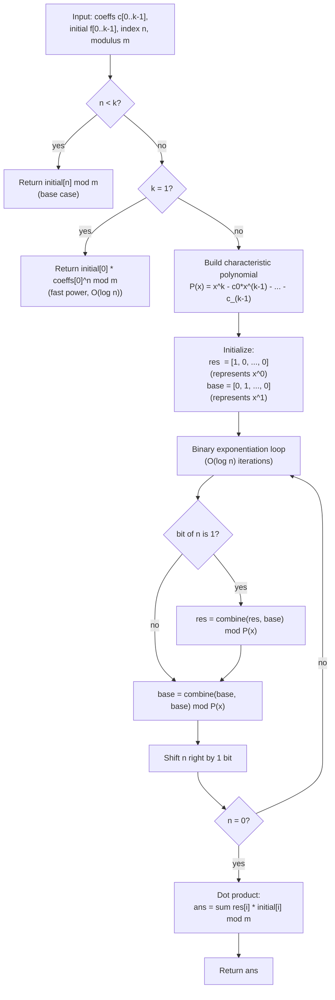

# Linear Recurrence (Kitamasa Method)

## What It Solves

Given a linear recurrence of order `k`:

```
f(n) = c0*f(n-1) + c1*f(n-2) + ... + c_{k-1}*f(n-k)
```

this module computes **f(n) mod M** in **O(k^2 log n)** time.

It is faster than matrix exponentiation if you only need **one term**.

## Big Picture

Matrix exponentiation treats the recurrence as a k×k matrix:

```
[f(n)    ]   [c0 c1 ... c_{k-1}]^n   [f(k-1)]
[f(n-1)  ] = [1  0  ...    0   ]   · [f(k-2)]
[  ...   ]   [0  1  ...    0   ]     [  ...  ]
[f(n-k+1)]   [0  0  ...    1   ]     [f(0)  ]
```

That is **O(k^3 log n)**.

**Kitamasa** skips the matrix and directly computes coefficients that express
`f(n)` as a linear combination of the initial terms.

## Key Insight

There exists a vector `A` such that:

```
f(n) = A0*f(0) + A1*f(1) + ... + A_{k-1}*f(k-1)
```

Kitamasa computes these coefficients by doing polynomial exponentiation and
reducing modulo the **characteristic polynomial**:

```
P(x) = x^k - c0*x^{k-1} - c1*x^{k-2} - ... - c_{k-1}
```

## Kitamasa Pipeline



## Polynomial Modular Exponentiation

The core operation is computing `x^n mod P(x)` in the polynomial ring
`Z/mZ[x] / P(x)`. A degree-(k-1) polynomial is stored as a coefficient array
of length k.

```
Polynomial represented as length-k coefficient vector:

  poly = [a0, a1, a2, ..., a_{k-1}]
       = a0 + a1*x + a2*x^2 + ... + a_{k-1}*x^(k-1)

Initial states:
  res  = [1, 0, 0, ..., 0]   represents the constant 1  = x^0
  base = [0, 1, 0, ..., 0]   represents the monomial x  = x^1

combine(a, b) steps:
  1. Multiply: form the (2k-1)-length product polynomial
     tmp[i+j] += a[i] * b[j]   (standard polynomial multiply)

  2. Reduce: fold each high-degree term back using P(x)
     The identity x^k = c0*x^(k-1) + c1*x^(k-2) + ... + c_{k-1}
     allows replacing x^k with a degree-(k-1) expression.
     Scan from degree 2k-2 down to degree k, substituting each time:

     for deg = 2k-2 downto k:
       v = tmp[deg]
       tmp[deg - 1] += v * c0
       tmp[deg - 2] += v * c1
       ...
       tmp[deg - k] += v * c_{k-1}

  3. Return: the first k entries of tmp

After log2(n) doublings the result vector res satisfies:
  f(n) = res[0]*f(0) + res[1]*f(1) + ... + res[k-1]*f(k-1)
```

## Fibonacci Example (k=2)

```
f(n) = f(n-1) + f(n-2)
coeffs = [1, 1]
initial = [f(0)=0, f(1)=1]
```

We want coefficients `[a0, a1]` such that:

```
f(n) = a0*f(0) + a1*f(1)
```

For small n:

```
f(0) => [1, 0]
f(1) => [0, 1]
f(2) => [1, 1]
f(3) => [1, 2]
f(4) => [2, 3]
```

## Visual: Coefficient Growth

```
Fibonacci coefficient vectors (a0, a1):

n=0: (1, 0)
n=1: (0, 1)
n=2: (1, 1)
n=3: (1, 2)
n=4: (2, 3)
n=5: (3, 5)

These are exactly Fibonacci pairs.
```

## Algorithm Outline (Binary Exponentiation on Polynomials)

We treat `x^n mod P(x)` as a coefficient vector of length k.

```
res  = representation of x^0
base = representation of x^1

repeat until n == 0:
  if n is odd: res = combine(res, base)
  base = combine(base, base)
  n >>= 1

answer = sum(res[i] * initial[i])
```

`combine` multiplies two coefficient vectors and reduces them modulo `P(x)`.

## Worked Example: Fibonacci f(7)

Binary: `7 = 111₂`

```
start: res = x^0, base = x^1

bit1 (LSB):
  n=7 is odd   => res  = res * base   => x^1        = [0, 1]
                   base = base^2      => x^2 = x + 1 = [1, 1]
  n >>= 1  (n=3)

bit2:
  n=3 is odd   => res  = x^1 * x^2   => x^3 = 2x+1  = [1, 2]
                   base = (x^2)^2     => x^4 = 3x+2  = [2, 3]
  n >>= 1  (n=1)

bit3:
  n=1 is odd   => res  = (2x+1)*(3x+2) => x^7 = 13x+8 = [8, 13]
                   base = (3x+2)^2      (unused)
  n >>= 1  (n=0)

Result vector: [8, 13]
f(7) = 8*f(0) + 13*f(1) = 8*0 + 13*1 = 13
```

The reduction step for x^2 (P(x) = x^2 - x - 1, so x^2 = x + 1):

```
tmp after multiply of [0,1] * [0,1]:

  degree:  0    1    2
  tmp:    [0,   0,   1]

Fold x^2 back (x^2 = 1*x^1 + 1*x^0):
  tmp[1] += tmp[2] * coeffs[0] = 1 * 1 = 1
  tmp[0] += tmp[2] * coeffs[1] = 1 * 1 = 1
  tmp[2] = 0 (discarded)

Result: [1, 1]  =>  x^2 mod P(x) = x + 1  ✓
```

## Example Usage

```mbt check
///|
test "linear recurrence fibonacci" {
  let m = 1000000007L
  let coeffs : Array[Int64] = [1L, 1L]
  let initial : Array[Int64] = [0L, 1L]
  debug_inspect(
    @linear_recurrence.linear_recurrence_nth(coeffs, initial, 7L, m),
    content="13",
  )
}
```

```mbt check
///|
test "linear recurrence geometric" {
  let m = 1000000007L
  let coeffs : Array[Int64] = [2L] // f(n) = 2*f(n-1)
  let initial : Array[Int64] = [1L]
  debug_inspect(
    @linear_recurrence.linear_recurrence_nth(coeffs, initial, 5L, m),
    content="32",
  )
}
```

```mbt check
///|
test "tribonacci" {
  let m = 1000000007L
  let coeffs : Array[Int64] = [1L, 1L, 1L]
  let initial : Array[Int64] = [0L, 0L, 1L]
  debug_inspect(
    @linear_recurrence.linear_recurrence_nth(coeffs, initial, 7L, m),
    content="13",
  )
}
```

## Complexity

| Method | Time | Space |
|--------|------|-------|
| Naive iteration | O(n) | O(k) |
| Matrix exponentiation | O(k^3 log n) | O(k^2) |
| **Kitamasa** | **O(k^2 log n)** | **O(k)** |

## Common Pitfalls

- `coeffs` and `initial` must have the same length `k`.
- Use a modulus `m` to prevent overflow.
- This method returns **only** f(n), not the full state vector.

## When to Use Kitamasa

- You need a **single term** of a large-index recurrence.
- The order `k` is large (saves a factor of `k` vs. matrix exponentiation).
- You are working modulo a number.

## Implementation Notes (This Package)

- Uses polynomial multiplication + reduction (`combine`).
- Binary exponentiation drives the doubling.
- Handles k=1 as a fast power special case via `pow_mod`.
- All arithmetic is performed modulo `m` throughout; `mod_norm` corrects for
  MoonBit's sign-preserving `%` on negative values.
