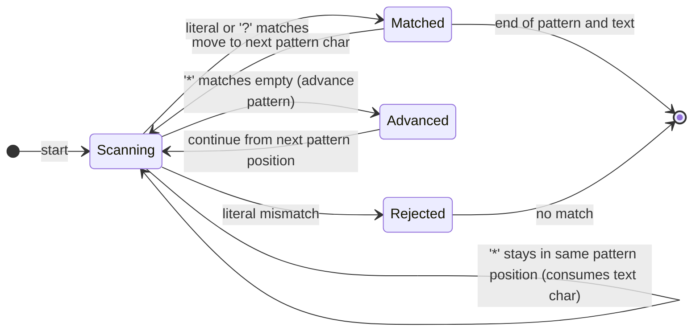
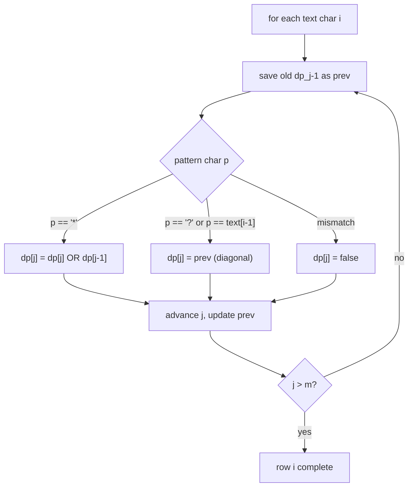

# Wildcard Matching

Match a text string against a pattern containing two wildcard characters:

- `?` matches exactly one character (any character)
- `*` matches any sequence of characters (including the empty sequence)

This package provides one function:

```
@wildcard_matching.wildcard_match(text, pattern) -> Bool
```

Time complexity: **O(n x m)** where `n` = text length, `m` = pattern length.
Space complexity: **O(m)** (rolling DP array, one row at a time).

---

## What Matching Means

```
pattern:  a*b?c
text:     aXXbYc

Breakdown:
  a   matches  a
  *   matches  XX   (zero or more characters)
  b   matches  b
  ?   matches  Y    (exactly one character)
  c   matches  c

Result: true
```

More examples at a glance:

```
text       pattern    result
---------  ---------  ------
"abc"      "a?c"      true      '?' matches 'b'
"ac"       "a?c"      false     '?' requires exactly one char
""         "*"        true      '*' matches empty
"hello"    "*"        true      '*' matches everything
"hello"    "h*o"      true      '*' matches "ell"
"abc"      "a*b?c"    false     '*' matches "" but then 'b' must precede '?c'
"aaabxc"   "a*b?c"    true      '*' matches "aa", '?' matches 'x'
"abc"      "???"      true      three '?' match three chars
"ab"       "???"      false     three '?' require three chars, text has two
"abcde"    "a*c*e"    true      first '*' matches "b", second '*' matches "d"
"abcde"    "*****"    true      all stars together match anything
```

---

## DP Definition

Define:

```
dp[i][j] = true  iff  text[0..i) matches pattern[0..j)
```

where `text[0..i)` is the first `i` characters and `pattern[0..j)` is the
first `j` pattern characters.

Base cases:

```
dp[0][0] = true                          empty text, empty pattern
dp[0][j] = true  if pattern[0..j) is all '*'
dp[0][j] = false otherwise
dp[i][0] = false for i >= 1             non-empty text, empty pattern
```

Recurrence:

```
pattern[j-1] is a literal char c or '?':

    dp[i][j] = dp[i-1][j-1]   if pattern[j-1]=='?' or pattern[j-1]==text[i-1]
             = false           otherwise

pattern[j-1] is '*':

    dp[i][j] = dp[i][j-1]     '*' matches empty (skip the star)
            OR dp[i-1][j]     '*' consumes text[i-1] (star extends one more)
```

The implementation keeps only the previous row in memory (O(m) space),
updating it in place from left to right using a `prev` variable to carry the
diagonal value `dp[i-1][j-1]`.

---

## DP Initialization Diagram

Before processing any text character (`i = 0`), the row is set so that
`dp[0][j]` is true only when the first `j` pattern characters are all `*`.

```
Pattern:   ""   "a"   "a*"   "a*b"   "a*b?"   "a*b?c"
           j=0   j=1   j=2    j=3     j=4      j=5

dp[0][j]:   T     F     F      F       F        F

Pattern:   ""   "*"   "**"   "**b"
           j=0   j=1   j=2    j=3

dp[0][j]:   T     T     T      F
```

The rule: `dp[0][j] = dp[0][j-1]` when `pattern[j-1] == '*'`, else `false`.

---

## Full DP Table Example

Pattern = `"a*c"`, Text = `"abc"` (n=3, m=3)

```
         j=0   j=1   j=2   j=3
         ""    "a"   "a*"  "a*c"

i=0 ""    T     F     F     F
i=1 "a"   F     T     T     F
i=2 "ab"  F     F     T     F
i=3 "abc" F     F     T     T

Answer = dp[3][3] = T
```

Reading the table:

- `dp[1][1]`: does `"a"` match `"a"`? Yes.
- `dp[1][2]`: does `"a"` match `"a*"`? Yes, star matches empty.
- `dp[2][2]`: does `"ab"` match `"a*"`? Yes, star matches `"b"`.
- `dp[3][3]`: does `"abc"` match `"a*c"`? Yes, star matched `"b"`.

---

## Step-by-Step Walkthrough

Pattern = `"a*b?c"`, Text = `"aXXbYc"` (n=6, m=5)

```
         j=0   j=1   j=2    j=3    j=4     j=5
         ""    "a"   "a*"   "a*b"  "a*b?"  "a*b?c"

i=0 ""    T     F     F      F      F       F
i=1 "a"   F     T     T      F      F       F
i=2 "aX"  F     F     T      F      F       F
i=3 "aXX" F     F     T      F      F       F
i=4 "aXXb" F    F     T      T      F       F
i=5 "aXXbY" F   F     T      F      T       F
i=6 "aXXbYc" F  F     T      F      F       T

Answer = dp[6][5] = T
```

Key transitions row by row:

```
Row i=1 ("a"):
  j=1, pattern[0]='a', text[0]='a' -> dp[1][1] = dp[0][0] = T
  j=2, pattern[1]='*'              -> dp[1][2] = dp[1][1] OR dp[0][2] = T OR F = T

Row i=2 ("aX"):
  j=2, pattern[1]='*'              -> dp[2][2] = dp[2][1] OR dp[1][2] = F OR T = T
  (star stretches to consume 'X')

Row i=4 ("aXXb"):
  j=3, pattern[2]='b', text[3]='b' -> dp[4][3] = dp[3][2] = T
  (diagonal: "aXX" matched "a*", 'b' matched 'b')

Row i=5 ("aXXbY"):
  j=4, pattern[3]='?', text[4]='Y' -> dp[5][4] = dp[4][3] = T

Row i=6 ("aXXbYc"):
  j=5, pattern[4]='c', text[5]='c' -> dp[6][5] = dp[5][4] = T
```

---

## Mermaid State Diagram: How '*' Behaves



The crucial insight: when `pattern[j-1] == '*'`, the DP cell `dp[i][j]` is
set by `dp[i][j-1]` (star matches empty, move pattern forward) OR `dp[i-1][j]`
(star consumes `text[i-1]`, stay at same pattern position to possibly consume
more). Both cases can be true simultaneously.

---

## Mermaid Flowchart: Row Update Logic



The variable `prev` always holds the value that was in `dp[j-1]` before
the current row's update began (the diagonal `dp[i-1][j-1]`). It is saved
before `dp[j-1]` is overwritten, then passed forward as `prev` in the next
iteration.

---

## Why '*' Is the Hard Part

A single `*` can match any number of characters. The DP handles this
naturally:

```
dp[i][j] = dp[i][j-1]   "use star to match zero chars here, move pattern"
         OR
dp[i][j] = dp[i-1][j]   "star already active, consume one more text char"
```

The second case re-uses the same `j` (same pattern position) for the next
text character, effectively letting the star "stay open" across many rows.

Multiple consecutive `*` characters behave identically to a single `*`
because the initialization loop already collapses them:

```
Pattern "***":
  dp[0][1] = true  (one '*')
  dp[0][2] = true  (two '*')
  dp[0][3] = true  (three '*')
```

---

## Space Optimization: Rolling Array

The full 2D table has (n+1) x (m+1) entries, but each row depends only on
the previous row. The implementation reuses a single array `dp` of length
`m+1`:

```
Before row i starts:
  dp[j] holds dp[i-1][j]   (result for text[0..i-1) vs pattern[0..j))

After row i finishes:
  dp[j] holds dp[i][j]     (result for text[0..i) vs pattern[0..j))
```

The diagonal `dp[i-1][j-1]` is saved in the variable `prev` before
`dp[j-1]` is overwritten by the row-i value.

```
State of the rolling array while processing row i=4 ("aXXb"), pattern "a*b?c":

Before j=3 update:
  dp = [ F, F, T, F, F, F ]   (from previous row i=3)
  prev = old dp[2] = T        (diagonal dp[3][2])

  pattern[2]='b', text[3]='b' -> dp[3] = prev = T

After j=3 update:
  dp = [ F, F, T, T, F, F ]
```

---

## API

```
wildcard_match(text : String, pattern : String) -> Bool
```

Returns `true` if `text` matches `pattern` using `?` (any single character)
and `*` (any sequence including empty).

---

## Example Usage

```mbt check
///|
test "wildcard basics" {
  debug_inspect(
    @wildcard_matching.wildcard_match("aaabxc", "a*b?c"),
    content="true",
  )
  debug_inspect(@wildcard_matching.wildcard_match("abc", "a?c"), content="true")
}
```

```mbt check
///|
test "wildcard star and empty" {
  debug_inspect(@wildcard_matching.wildcard_match("", "*"), content="true")
  debug_inspect(
    @wildcard_matching.wildcard_match("hello", "h*o"),
    content="true",
  )
}
```

```mbt check
///|
test "wildcard edge cases" {
  debug_inspect(@wildcard_matching.wildcard_match("", ""), content="true")
  debug_inspect(@wildcard_matching.wildcard_match("a", ""), content="false")
  debug_inspect(
    @wildcard_matching.wildcard_match("abcde", "a*c*e"),
    content="true",
  )
  debug_inspect(
    @wildcard_matching.wildcard_match("abcde", "*****"),
    content="true",
  )
  debug_inspect(@wildcard_matching.wildcard_match("abc", "???"), content="true")
  debug_inspect(@wildcard_matching.wildcard_match("ab", "???"), content="false")
}
```

---

## Complexity

| Dimension | Value  | Explanation                     |
|-----------|--------|---------------------------------|
| Time      | O(n*m) | one cell per (text, pattern) pair |
| Space     | O(m)   | single rolling array of length m+1 |

`n` = text length, `m` = pattern length.

---

## Common Applications

```
File globbing:        "*.txt", "test?.py", "src/**"
SQL LIKE patterns:    '%' is '*', '_' is '?'
Log filtering:        "ERROR: *timeout*"
Input validation:     "202?-??-??"  (loose date format check)
Shell completion:     pattern-based tab completion
```

---

## Common Pitfalls

- `*` can match zero characters. The pattern `"a*c"` matches `"ac"`.
- `?` matches exactly one character. The pattern `"a?c"` does not match `"ac"`.
- Multiple consecutive `*` are equivalent to a single `*`.
- A pattern consisting entirely of `*` characters matches any text including
  the empty string.
- A non-empty text never matches the empty pattern.
- Pattern `"a*"` matches any text starting with `'a'`, including `"a"` itself.
- Indices are half-open: `text[0..i)` means the first `i` characters
  (characters at positions 0, 1, ..., i-1).
